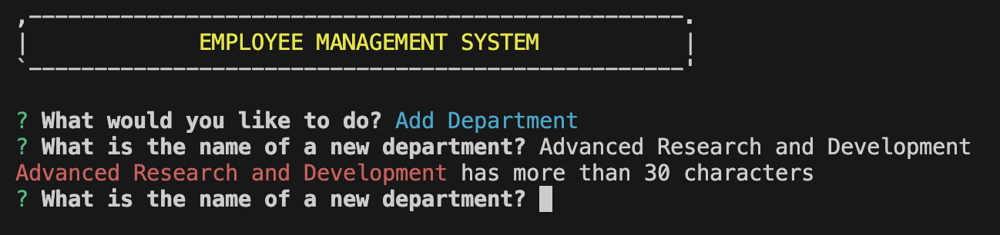

# TrackmyEmployees
TrackmyEmployees is a simple web application to track employees in my company. This application uses a command-line interface (CLI) and it is built with Node.js, PostgreSQL, and Inquirer.js. It allows users to manage company departments, roles, and employees. It utilizesfunctionalities to add, delete, update, and view records in the database.

## Table Content
- [Features](#features)
- [Installation](#installation)
- [Usage](#usage)
- [Structure](#structure)
- [Exceptions](#exceptions)
- [Links] (#links)
- [Acknowledgements](#acknowledgements)
- [Contact](#contact)

## Features
Below are all the features that are included in this application

* Add Department: Create a new department
* Add Employee: Add a new employee to the database.
* Add Role: Define a new role and assign it to a department.
* Delete Department: Remove a department from the database.
* Delete Employee: Remove an employee from the database.
* Delete Role: Remove a role from the database.
* Update Employee Manager: Change the manager of an employee.
* Update Employee Role: Update an employee's role.
* View All Departments: Display a list of all departments.
* View All Employees:Display a list of all employees along with their roles, salaries, and managers.
* View All Roles: Display a list of all roles along with their departments and salaries.
* View Employees by Department:** View employees categorized by their department.
* View Employees by Manager:** View employees categorized by their managers.
* View the Total Utilized Budget of a Department:** Calculate and display the total salary budget of a department.

## Instalation
To install this application, follow the steps below:
* Clone the repository to your local machine.
* Install the required dependencies by running the following command in the terminal: npm install.
* Create a .env file in the root directory of the project and add the following environment variables:
* PGDATABASE=trackmyemployees
* PGPASSWORD=yourpassword
* PGUSER=yourusername
* PGHOST=localhost
* PGPORT=5432
* Run the following command in the terminal to create the database: npm run create-database
* Run the following command in the terminal to seed the database: npm run seed
* Run the following command in the terminal to start the application: npm start

-Prerequisites necessary to run the application 
* Node.js
* PostgreSQL
* Inquirer.js

1. Clone the repository:

git clone: git@github.com:Faiza-Haque/TrackmyEmployees.git
cd employee-management-system
Install dependencies:

2. npm install
Set up PostgreSQL database:

3. Run the following command to set up PostgresSQL database

psql -U [your-user-name] (for me: postgres)
\i db/schema.sql
\i db/seeds.sql

## Usage
To use this application, run the following command in the terminal:
* npm start

-The application will prompt you to select an option from the menu. Select an option and follow the
-Prompts to perform the desired action.
-Follow the prompts to interact with the application.

These are list of option you will be presented with:
Add Department: You will be prompted to enter the name of the new department.
Add Employee: You will be prompted to enter the details of the new employee, including their first name, last name, role, and manager.
Add Role: You will be prompted to enter the title, salary, and department of the new role.
Delete Department: You will be prompted to select a department to delete.
Delete Employee: You will be prompted to select an employee to delete.
Delete Role: You will be prompted to select a role to delete.
Update Employee Manager: You will be prompted to select an employee and their new manager.
Update Employee Role: You will be prompted to select an employee and their new role.
View All Departments: The list of all departments will be displayed.
View All Employees: The list of all employees along with their roles, salaries, and managers will be displayed.
View All Roles: The list of all roles along with their departments and salaries will be displayed.
View Employees by Department: You will be prompted to select a department, and the employees in that department will be displayed.
View Employees by Manager: You will be prompted to select a manager, and the employees managed by that manager will be displayed.
View the Total Utilized Budget of a Department: You will be prompted to select a department, and the total salary budget of that department will be displayed.
Exit: Exiting the application.

## Structure
* index.js: The main entry point of the application; this contains the main driver functions.
* Commands and Functions: Handle different CRUD operations and queries.
* Assisted Functions: Utility functions to fetch the lists from the database and validate input.
* db: Contains the database schema and seeds.
* package.json: Contains the dependencies and scripts for the application.

## Exceptions
-WHEN user enters wrong username or password of psql account.
-THEN system will display an error message on console.

-WHEN user enters more than 30 characters of department name, role title, employee name.
-THEN the system will highlight input by red color and display an error message.

## Links

[video] (https://drive.google.com/file/d/1xBqYU9nmpopxzz3cPW8Gc2XTXf8BTU7s/view)
[githublink] (git@github.com:Faiza-Haque/TrackmyEmployees.git)

## Acknowledgments 
- Tutors and TAs
- Thinh, Marissa, Anna
- My Instructor
- My Friends
Everyone listed above helped me complete this project. I would like to thank them for their support.

## Contact Information
Thanks for exploring my Repo!

If you would like to know more please feel free to contact me:
Email: faizahaque90@gmail.com
GitHub URL: https://github.com/Faiza-Haque
LinkedIn URL: https://www.linkedin.com/authwall 